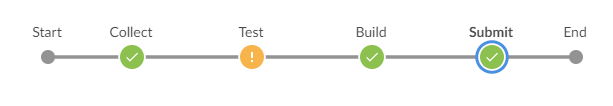

# Blender-Geometry-CI

A proof-of-concept framework for CI(continious integrate) pipeline of geometry with blender.
The CI pipeline runs on Jenkins, inside blender docker container



Pipeline has 4 steps:
1. Collect, find all fbx files inside `geos` folder and write an manifest, with a python docker container.  
2. Test, run all test scripts under `tests` folder over each fbx file, in a blender docker container. Here I add one script for test polycount density.
3. Build, run all build scripts under `builds` folder over each fbx file, in a blender docker container. Here I add one script for generate LOD meshs.  
4. Submit, add and commit everything newly created to git.  

# Requirement
* Windows 10  
* Docker for windows  
* Jenkins  

Note: You need to grant user access to jenkins workspace, usually at `C:\Program Files(x86)\Jenkins\workspace`, so that docker could write files into the workspace.  

The project does not works on Linus, as CI script are written in PowerShell, but you could write a shell version.

# To run

Assuming Docker and Jenkins are installed.
1. fork this project to your repo url.  
2. add a fbx file under `geos` folder and push.  
3. create a "Pipeline" item in Jenkins, set repo url to your repo url, and use Jenkinsfile for pipeline.  
4. run the pipeline.  
5. generated mesh will be under your jenkins workspace, you could then push to git.

Note that the blender docker is around 1GB and could be slow to download.

# To write test and build script  


### Test Script  

for unit-test over geometry, template is like:  
```
import bpy
from bpy_runner import blender_fbx_test

@blender_fbx_test
def main(parm1, parm2, ...):
    # do anything in blender
```

name this script `test_***.py` and put it under `tests` folder, pipeline will recognize and run it under test stage.  

parameter could be specified in test scripts `ci/tests.ps1`  

### Build Script  

Different from unit-test, build script import the geometry, do some stuff, then export geometry under same filename.  Whereas test script does not export geometry.  
for build over geometry, template is like:  
```
import bpy
from bpy_runner import blender_fbx_build

@blender_fbx_build
def main(parm1, parm2, ...):
    # do anything in blender
```

name this script `build_***.py` and put it under `builds` folder, pipeline will recognize and run it under build stage.  

parameter could be specified in test scripts `ci/builds.ps1`  

My Blog on this: [Build A Blender Geometry CI Pipeline |搭建一个Blender模型CI(持续集成)框架](http://ma-yidong.com/2020/07/11/build-a-blender-geometry-ci-pipeline/)

# Reference
[Blender in Docker: nytimes/blender](https://github.com/nytimes/rd-blender-docker)  
